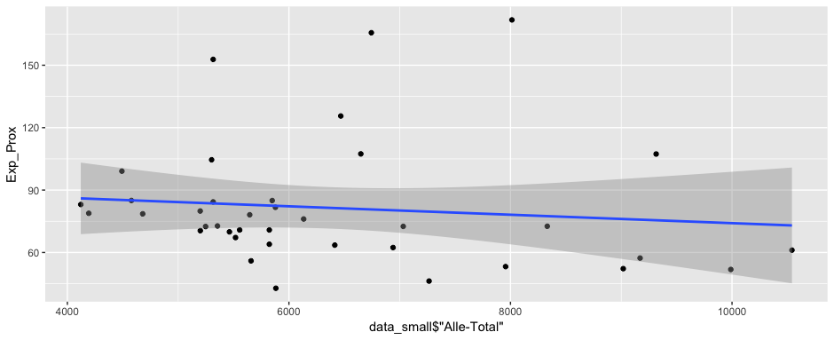

# Berufsrisiko Corona

### Analyse des Ansteckungsrisiko nach Geschlecht und Einkommen


Die Fragen, die in der Untersuchung versucht werden zu beantworten sind:

- Zeigen Berufe, die in der Schweiz eine hohe Frauenquote haben, ein höheres Ansteckungsrisiko für Infektionskrankheiten?
- Haben Gutverdiener ein tieferes Ansteckungsrisiko als Geringverdiener?

Das Ansteckungsrisiko erbigt sich auf Basis von Daten über die Arbeitsbedingungen. Für jeden Beruf gibt es zwei Indikatoren: Das Risiko, bei der Arbeit mit Krankheiten in Kontakt zu kommen, und die körperliche Nähe zu anderen Menschen. Die Daten lassen sich auf Schweizer Berufsgruppen übertragen und durch Arbeitsmarktdaten des Bundesamts für Statistik ergänzen. Lineare Regressionen ergeben anschliessend Aufschluss darüber, ob Zusammenhänge bestehen und diese signifikant sind.


#### 
**Datenquellen**: [National Center for O*NET Development](https://www.onetonline.org/), [Bundesamt für Statistik](https://www.bfs.admin.ch/bfs/de/home/statistiken/arbeit-erwerb/erhebungen/sake.html)

**Artikel**: [Frauen haben bei der Arbeit ein höheres Ansteckungsrisiko als Männer](https://www.tagesanzeiger.ch)

**Inspiration**: [The Workers Who Face the Greatest Coronavirus Risk](https://www.nytimes.com/interactive/2020/03/15/business/economy/coronavirus-worker-risk.html)

## Inhaltsverzeichnis

1. Datenaufbereitung
	- [corona_berufe.ipynb](https://github.com/tamedia-ddj/corona-berufe/blob/master/corona_berufe.ipynb)
2. Datenanlyse
	- [analyse.R](https://github.com/tamedia-ddj/corona-berufe/blob/master/analyse.R)
3. Output Files


## 1. Datenaufbereitung

Als Basis der Untersuchung dienten zwei Datensätze zu «physischen Arbeitsbedingen» des [National Center for O*NET Development](https://www.onetonline.org/): `Exposed_to_Disease_or_Infections.csv` und `Physical_Proximity.csv`. Beide auf Umfragedaten basierten Indikatoren beschreiben die Berufe auf einer Skala 0 bis 100, wobei zB. bei `Physical_Proximity.csv` die Werte folgende Beudtung haben:

- 0 = «I don't work near other people»
- 100 = «Very close (near touching)»

Die Indikatoren werden in die Tabellen `proximity` bzw. `exposure` importiert.

Insgesamt sind in den Daten 968 nach Standard Occupational Classification (SOC) kodierten Berufe bewertet. Mithilfe der Tabelle `soc10_isco08` wurde diese Kodierungen in die in der Schweiz geläufige ISCO-Kodierung übersetzt.

Die neusten vom BFS zur Verfügung gestellten Werte zu der Anzahl Beschäftigter und weiblicher Beschäftgter (woraus der Frauenanteil berechnet wird) pro Beruf werden in die Tabelle `gender` importiert. Die Berufe sind hier feingliedrig und bis auf 5 Stufen klassifiziert (nach CH-ISCO-19-Standard). Die Übersetzung von SOC zu ISCO berücksichtigt die Werte bis zu 4. Stufe (*Berufsgattung*). Diese Stufen sind (am Beispiel von Lehrkräften im Primarbereich):

Code | Stufe
--- | --- 
`2` - Berufshauptgruppe | Intellektuelle und wissenschaftliche Berufe
`23` - Berufsgruppe | Lehrkräfte
`234` - Berufsuntergruppe| Lehrkräfte im Primar- und Vorschulbereich
`2341` - Berufsgattung| Lehrkräfte im Primarbereich

Die neu zusammengeführten Daten sind in der Tabelle `data`zu finden.

Zur Bestimmung der *Ansteckungsrisikos* werden die *proximity*- und *exposure*-Werte zu einem neuen **Index** (in der Spalte `exp_prox`) zusammengeführt. Dabei bilden wir einen Durchschnitt der beiden Werte, so dass auch der Index `exp_prox` auf einer Skala zwischen 0 und 100 normiert bleibt.

Nicht für alle Berufsgattung finden sich Entsprechungen in `exposure`- und `proximity`-Tabellen. Da jedoch Daten zu der Anzahl Beschäftgter pro Berufsgruppe vorliegen, kann man erkennen dass 3.5 Mio. Erwerbstätige direkt klassifiziert werden können. Um die Zahl noch weiter zu erhöhen, treffen wir folgende Annahme:
	
**Annahme**: Berufe innerhalb der selben Berufsgruppe, habe ähnliche *proximity*- und *exposure*-Werte

Haben also andere Berufe in der selben Berufsgruppe einen *proximity*- und *exposure*-Wert zugewiesen, wird deren Durchschnitt für die nicht bewerteten Berufe übernommen. Somit erweitert sich die Aussagekraft auf Berufe von 4.08 Mio. Erwerbstätigen.

```
data['Orig_Source'] = 1
data.loc[pd.isnull(data['Exp_Prox']),'Orig_Source'] = 0

for index, job in data[data.Orig_Source == 0].iterrows():
    proximity_value = data[(data.ISCO_kurz == job['ISCO_kurz']) & (data.Orig_Source == 1)].Proximity.mean()
    exposure_value = data[(data.ISCO_kurz == job['ISCO_kurz']) & (data.Orig_Source == 1)].Exposure.mean()
    exp_prox_value = data[(data.ISCO_kurz == job['ISCO_kurz']) & (data.Orig_Source == 1)].Exp_Prox.mean()
    data.loc[index, "Proximity"] = proximity_value
    data.loc[index, "Exposure"] = exposure_value
    data.loc[index, "Exp_Prox"] = exp_prox_value
``` 


Daten zu den Durschnittseinkommen importieren wir in die Tabelle `salary`. Diesen Daten liegen nur auf Berufsgruppen-Ebene (Stufe 2) vor. Daher werden die Variablen `exposure`, `proximity`, und `Frauenanteil` gewichtet nach Anzahl Beschäftigter in der Berufsgattung auf die Berufsgruppen umgerechnet und in der neuen Tabelle `data_small` zusammengefasst.

``` 
data_small = salary.copy()
for index, job in data_small.iterrows():
    exposure_value = 0
    proximity_value = 0
    women_value = 0
    total_sum = data.loc[(data.ISCO_kurz == job["ISCO"]) & (data.Orig_Source == 1),"Total (in T)"].sum()
    total_employed = data.loc[(data.ISCO_kurz == job["ISCO"]),"Total (in T)"].sum()
    for i, row in data.loc[(data.ISCO_kurz == job["ISCO"]) & (data.Orig_Source == 1),:].iterrows():
        exposure_value += row['Exposure'] * row['Total (in T)']
        proximity_value += row['Proximity'] * row['Total (in T)']
    for i, row in data.loc[(data.ISCO_kurz == job["ISCO"]),:].iterrows():
        women_value += (row['Frauenanteil'] * row['Total (in T)']) if not pd.isnull(row['Frauenanteil'] * row['Total (in T)']) else 0
    exposure_value = exposure_value / total_sum
    proximity_value = proximity_value / total_sum
    women_value = women_value / total_employed
    data_small.loc[index, 'Exposure'] = exposure_value
    data_small.loc[index, 'Proximity'] = proximity_value
    data_small.loc[index, 'n (in Tausend)'] = total_employed
    data_small.loc[index, 'Frauenanteil'] = women_value
data_small['Exp_Prox'] = (data_small['Exposure'] + data_small['Proximity']) / 2
``` 

Die beiden Tabelle `data` und `data_small` werden zur weiteren Analyse in *R* exportiert. 


## 2. Datenanalyse 


In *R* importieren wir die beiden Datensätze in in die Dataframes `data_large` (für die feingliedrigen Daten auf Berufsgattungsebene) und `data_small` (für die gröberen Daten auf Berufsgruppenebene die Daten zum Durchschnittseinkommen beinhalten).

In diversen (nach Anzahl Erwerbstätigen gewichteten) Regressionen werden Korrelationen zwischen Variablen untersucht. So erkennen wir als Nebenprodukt auch, dass der Ausländeranteil im Beruf und das Ansteckungsrisiko nicht korrelieren. Auf die Ursprungfragen fokussiert sehen wir:


- Je höher der Frauenanteil im Beruf, desto grösser ist die Ansteckungsgefahr (`exp_prox`). Der Zusammenhang ist wie erwartet positiv.



- Der Zusammenhang zwischen Einkommen und Ansteckungsgefahr ist wie erwartet negativ - jedoch sehr schwach und nicht signifikant. Die Verteilung und der erkannte Zusammenhang könnten also auch rein zufällig entstanden sein (siehe grauen Fehlerbereich).


## 3. Output Files

Für weitere Visualisierung exportieren wir 2 Dateien:

### output/jobs_detailed.csv

Beschreibung der Datei die aus dem Dataframe `data` erstellt wurde.

Variable | Beschreibunng
--- | --- 
`Berufsgattung ` | ISCO Code der Berufsgattung
`Bezeichnung ` | Berufsbeschreibung
`Total (in T) ` | Anzahl Erwerbstätige innerhalb der Berufsgattung in Tausend
`Frauenanteil ` | Frauenanteil für Berufsgattung in %
`Auslaenderanteil ` | Ausländeranteil für Berufsgattung in %
`Exposure ` | Risiko, bei der Arbeit mit Krankheiten in Kontakt (zw. 0 und 100)
`Proximity ` | Körperliche Nähe zu anderen Menschen (zw. 0 und 100)
`Exp_Prox ` | Mittelwert aus `Exposure` und `Proximity` – Ansteckungsrisiko
`ISCO_kurz ` | ISCO Code der Berufsgruppe
`Orig_Source ` | Kennzeichnung ob Werte zu `Exposure` und `Proximity` aus Originaldatensatz stammen (1) oder selber berechnet wurden (0)


### output/jobs_groups.csv

Beschreibung der Datei die aus dem Dataframe `data_small` erstellt wurde.

Variable | Beschreibunng
--- | --- 
`ISCO ` | ISCO Code der Berufsgruppe
`Beruf ` | Berufsgruppenbeschreibung
`Alle-Total ` | Durschnittseinkommen der Berufsgruppe
`Exposure ` | Risiko, bei der Arbeit mit Krankheiten in Kontakt (zw. 0 und 100)
`Proximity ` | Körperliche Nähe zu anderen Menschen (zw. 0 und 100)
`Exp_Prox ` | Mittelwert aus `Exposure` und `Proximity` – Ansteckungsrisiko
`Frauenanteil ` | Frauenanteil für Berufsgruppe in %
`n (in Tausend) ` | Anzahl Erwerbstätige innerhalb der Berufsgruppe in Tausend


## Lizenz

*Berufsrisiko Corona* is free and open source software released under the permissive MIT License.

